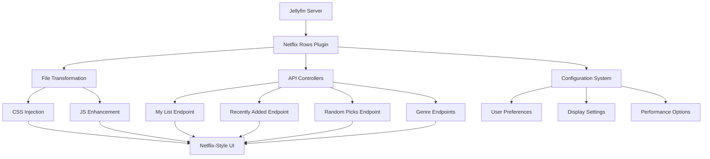

# 🎬 Netflix Rows Plugin for Jellyfin

[](https://github.com/FigmaCode/jellyfin-plugin-netflix-rows/actions/workflows/build-and-release.yml)
[](https://github.com/FigmaCode/jellyfin-plugin-netflix-rows/releases/latest)
[](https://github.com/FigmaCode/jellyfin-plugin-netflix-rows/releases)
[](https://jellyfin.org/)
[](https://dotnet.microsoft.com/)
[](LICENSE)

**Transform your Jellyfin home screen into a Netflix-like experience with dynamic horizontal content rows, smart content organization, and a modern streaming interface.**

> ⚡ **New in v1.0.1.2**: Complete exception handling overhaul, performance improvements with LoggerMessage delegates, and comprehensive code quality enhancements!

<div align="center">
  
### 🌟 **Experience Premium Streaming Interface** 🌟

*Netflix-style rows • Smart content discovery • Responsive design • Theme integration*

[🚀 **Quick Install**](#-installation) • [⚙️ **Configuration**](#-configuration) • [📱 **Features**](#-features) • [🆘 **Support**](#-support--troubleshooting)

</div>

---

## ✨ Features

### � **Core Functionality**
- �🎬 **Netflix-Style Interface**: Smooth horizontal scrolling rows with elegant hover effects
- 📚 **Intelligent Content Organization**: Automatic categorization based on user behavior and metadata
- ⭐ **My List Integration**: Seamless favorites management using Jellyfin's built-in system
- 🔀 **Smart Discovery**: Random picks algorithm for content exploration
- 📅 **Timeline-Based Sections**: Recently added content with configurable timeframes
- 🎭 **Dynamic Genre Rows**: Customizable genre-based content sections

### 🎨 **Design & Experience**
- 📱 **Fully Responsive**: Optimized for desktop, tablet, and mobile devices
- 🌙 **Theme Integration**: Perfect compatibility with Jellyfin's dark and light themes
- ⚡ **Performance Optimized**: Lazy loading, efficient rendering, and minimal resource usage
- 🎨 **Modern UI/UX**: Clean, intuitive interface following modern design principles
- ♿ **Accessibility**: Full support for screen readers and keyboard navigation
- 🌐 **Multi-Language Ready**: Internationalization support for global users

### 🔧 **Advanced Configuration**
- ⚙️ **Granular Control**: Fine-tune every aspect of content display
- 🎚️ **Flexible Row Management**: Enable/disable sections per user preference
- 📊 **Content Limits**: Configurable item counts per row and section
- 🏷️ **Custom Genre Mapping**: Create custom display names for genres
- 🔄 **Real-Time Updates**: Dynamic content refresh without page reload
- 🎯 **Smart Filtering**: Advanced content filtering and sorting options

---

## 📋 Requirements

### 🔗 **Required Dependencies**
Before installing Netflix Rows, ensure these plugins are installed and enabled:

| Plugin | Purpose | Installation |
|--------|---------|--------------|
| **[File Transformation Plugin](https://github.com/jellyfin/jellyfin-plugin-file-transformation)** | Injects CSS styling for Netflix interface | Plugin Catalog or Manual |
| **[Home Screen Sections Plugin](https://github.com/jellyfin/jellyfin-plugin-home-sections)** *(Optional)* | Enhanced home screen management | Plugin Catalog or Manual |

### 🖥️ **System Requirements**
- **Jellyfin Server**: 10.10.7 or later
- **.NET Runtime**: 8.0+
- **Browsers**: All modern browsers with CSS Grid support
- **Platforms**: Windows, Linux, macOS, Docker

### 📦 **Plugin Repository**
Add this repository URL to your Jellyfin plugin catalogs:
```
https://github.com/FigmaCode/jellyfin-plugin-netflix-rows/releases/latest/download/repository.json
```

---

## 🚀 Installation

### 🎯 **Method 1: Plugin Repository (Recommended)**

1. **Add Repository**:
   - Navigate to **Admin Dashboard → Plugins → Repositories**
   - Click **"+"** to add new repository
   - Enter: `https://github.com/FigmaCode/jellyfin-plugin-netflix-rows/releases/latest/download/repository.json`
   - Save and refresh the catalog

2. **Install Plugin**:
   - Go to **Admin Dashboard → Plugins → Catalog**
   - Search for **"Netflix Rows"**
   - Click **Install** and restart Jellyfin

3. **Verify Installation**:
   - Check **Admin Dashboard → Plugins → My Plugins**
   - Confirm "Netflix Rows" appears in the list

### 📁 **Method 2: Manual Installation**

1. **Download Latest Release**:
   ```bash
   # Download the latest plugin ZIP
   curl -L -o netflix-rows.zip https://github.com/FigmaCode/jellyfin-plugin-netflix-rows/releases/latest/download/jellyfin-plugin-netflix-rows-v1.0.1.2.zip
   ```

2. **Extract to Plugins Directory**:
   
   **Windows**:
   ```powershell
   # Extract to Jellyfin plugins directory
   Expand-Archive -Path netflix-rows.zip -DestinationPath "$env:ProgramData\Jellyfin\Server\plugins\Netflix Rows\"
   ```
   
   **Linux/macOS**:
   ```bash
   # Create plugin directory and extract
   sudo mkdir -p /var/lib/jellyfin/plugins/Netflix\ Rows
   sudo unzip netflix-rows.zip -d /var/lib/jellyfin/plugins/Netflix\ Rows/
   sudo chown -R jellyfin:jellyfin /var/lib/jellyfin/plugins/Netflix\ Rows/
   ```
   
   **Docker**:
   ```bash
   # Mount plugins directory and extract
   docker cp netflix-rows.zip jellyfin:/config/plugins/
   docker exec jellyfin unzip /config/plugins/netflix-rows.zip -d /config/plugins/Netflix\ Rows/
   ```

3. **Restart Jellyfin**:
   ```bash
   # Restart Jellyfin service
   sudo systemctl restart jellyfin
   # OR for Docker:
   docker restart jellyfin
   ```

### ✅ **Post-Installation Verification**

1. **Check Plugin Status**:
   - Navigate to **Admin Dashboard → Plugins → My Plugins**
   - Confirm **Netflix Rows v1.0.1.2** is listed and enabled

2. **Test API Endpoints**:
   ```bash
   # Test plugin API (replace with your server URL)
   curl http://your-jellyfin-server:8096/NetflixRows/Test
   # Expected response: "Netflix Rows Controller is working! [timestamp]"
   ```

3. **Verify Home Screen Changes**:
   - Navigate to Jellyfin home screen
   - Look for Netflix-style horizontal rows
   - Check responsive behavior on different screen sizes

---

## ⚙️ Configuration

### 🎛️ **Basic Setup**

1. **Access Plugin Settings**:
   - Go to **Admin Dashboard → Plugins → My Plugins**
   - Click **Netflix Rows** → **Settings**

2. **Initial Configuration**:
   ```json
   {
     "EnableMyList": true,
     "EnableRecentlyAdded": true,
     "EnableRandomPicks": true,
     "EnabledGenres": ["Action", "Comedy", "Drama"],
     "MaxItemsPerRow": 25
   }
   ```

### 📊 **Advanced Configuration Options**

#### **🌟 My List Settings**
```json
{
  "EnableMyList": true,
  "MyListLimit": 25,
  "MyListSortOrder": "DateCreated", // "DateCreated", "Name", "Random"
  "MyListSortDescending": true
}
```

#### **📅 Recently Added Settings**
```json
{
  "EnableRecentlyAdded": true,
  "RecentlyAddedDays": 30,
  "RecentlyAddedLimit": 25,
  "RecentlyAddedTypes": ["Movie", "Series"] // Filter content types
}
```

#### **🎲 Random Picks Settings**
```json
{
  "EnableRandomPicks": true,
  "RandomPicksLimit": 20,
  "RandomPicksRefreshInterval": 3600, // Seconds between refresh
  "RandomPicksExcludeWatched": true
}
```

#### **🎭 Genre Configuration**
```json
{
  "EnabledGenres": [
    "Action", "Adventure", "Animation", "Comedy", "Crime",
    "Documentary", "Drama", "Family", "Fantasy", "Horror",
    "Music", "Mystery", "Romance", "Sci-Fi", "Thriller", "War", "Western"
  ],
  "GenreDisplayNames": {
    "Sci-Fi": "Science Fiction",
    "Action": "Action & Adventure",
    "Animation": "Animated Movies & Shows"
  },
  "GenreRowLimits": {
    "Action": 30,
    "Comedy": 25,
    "Horror": 20
  }
}
```

#### **🎨 Display & Performance**
```json
{
  "MaxItemsPerRow": 50,
  "LazyLoadingEnabled": true,
  "ShowGenreLabels": true,
  "EnableHoverEffects": true,
  "ResponsiveBreakpoints": {
    "mobile": 768,
    "tablet": 1024,
    "desktop": 1440
  }
}
```

### 🔧 **Configuration Examples**

#### **📱 Mobile-Optimized Setup**
```json
{
  "MaxItemsPerRow": 15,
  "GenreRowLimits": {
    "Action": 15,
    "Comedy": 15,
    "Drama": 15
  },
  "EnableHoverEffects": false,
  "LazyLoadingEnabled": true
}
```

#### **🖥️ Large Screen Setup**
```json
{
  "MaxItemsPerRow": 50,
  "GenreRowLimits": {
    "Action": 40,
    "Comedy": 35,
    "Drama": 30,
    "Horror": 25
  },
  "EnableHoverEffects": true,
  "ShowGenreLabels": true
}
```

#### **🎯 Content Discovery Focus**
```json
{
  "EnableMyList": true,
  "EnableRecentlyAdded": true,
  "EnableRandomPicks": true,
  "RandomPicksLimit": 30,
  "RandomPicksRefreshInterval": 1800,
  "EnabledGenres": ["Action", "Comedy", "Drama", "Thriller", "Sci-Fi"],
  "GenreRowLimits": {
    "Action": 25,
    "Comedy": 25,
    "Drama": 20,
    "Thriller": 20,
    "Sci-Fi": 25
  }
}
```

---

## 🏗️ Architecture & Technical Details

### 🔄 **Plugin Architecture**



### 🔌 **Integration Components**

#### **File Transformation Pipeline**
- **CSS Injection**: Seamlessly integrates Netflix-style CSS into Jellyfin's interface
- **JavaScript Enhancement**: Adds interactive behaviors and responsive design logic
- **Theme Compatibility**: Automatically adapts to Jellyfin's dark/light theme switching

#### **API Endpoint System**
- **RESTful Design**: Clean, predictable API endpoints for all content sections
- **Performance Optimization**: Efficient data fetching with caching and lazy loading
- **Error Handling**: Comprehensive exception handling with specific error responses

#### **Configuration Management**
- **Real-time Updates**: Configuration changes apply immediately without restart
- **Validation**: Input validation and sanitization for security and stability
- **Backward Compatibility**: Maintains compatibility across Jellyfin versions

### 📊 **Data Flow Process**

1. **Initialization**:
   ```
   Plugin Startup → Register CSS/JS Transformations → Initialize API Controllers
   ```

2. **Content Discovery**:
   ```
   User Request → API Endpoint → Library Query → Data Processing → Response
   ```

3. **UI Rendering**:
   ```
   CSS Injection → DOM Manipulation → Netflix-Style Layout → Interactive Behaviors
   ```

### ⚡ **Performance Optimizations**

- **LoggerMessage Delegates**: High-performance logging with compile-time optimization
- **Async Operations**: Non-blocking I/O operations with `ConfigureAwait(false)`
- **Memory Management**: Efficient resource disposal and memory allocation patterns
- **Caching Strategy**: Intelligent caching for frequently accessed content
- **Lazy Loading**: Content loaded on-demand to reduce initial page load time

---

## 🔌 API Reference

### 🔍 **Testing Endpoints**

#### **Health Check**
```http
GET /NetflixRows/Test
```
**Response**: `"Netflix Rows Controller is working! [timestamp]"`

#### **Configuration**
```http
GET /NetflixRows/Config
```
**Response**: Current plugin configuration JSON

```http
POST /NetflixRows/Config
Content-Type: application/json

{
  "EnableMyList": true,
  "EnableRecentlyAdded": true,
  "MaxItemsPerRow": 25
}
```

### 📚 **Content Endpoints**

#### **My List Section**
```http
POST /NetflixRows/MyListSection
Content-Type: application/json

{
  "UserId": "user-guid-here",
  "AdditionalData": null
}
```

#### **Recently Added Section**
```http
POST /NetflixRows/RecentlyAddedSection
Content-Type: application/json

{
  "UserId": "user-guid-here",
  "AdditionalData": null
}
```

#### **Random Picks Section**
```http
POST /NetflixRows/RandomPicksSection
Content-Type: application/json

{
  "UserId": "user-guid-here",
  "AdditionalData": null
}
```

#### **Genre Section**
```http
POST /NetflixRows/GenreSection
Content-Type: application/json

{
  "UserId": "user-guid-here",
  "AdditionalData": "Action"
}
```

### 📄 **Response Format**

All content endpoints return data in this format:
```json
{
  "Items": [
    {
      "Id": "item-guid",
      "Name": "Content Title",
      "Type": "Movie|Series",
      "Year": 2024,
      "Overview": "Content description...",
      "ImageTags": {
        "Primary": "image-tag"
      },
      "UserData": {
        "IsFavorite": true,
        "PlayedPercentage": 0,
        "Played": false
      }
    }
  ],
  "TotalRecordCount": 25
}
```

### 🛠️ **Development API Usage**

#### **cURL Examples**
```bash
# Test plugin status
curl -X GET "http://localhost:8096/NetflixRows/Test"

# Get current configuration
curl -X GET "http://localhost:8096/NetflixRows/Config"

# Update configuration
curl -X POST "http://localhost:8096/NetflixRows/Config" \
  -H "Content-Type: application/json" \
  -d '{"EnableMyList": true, "MaxItemsPerRow": 30}'

# Get My List content
curl -X POST "http://localhost:8096/NetflixRows/MyListSection" \
  -H "Content-Type: application/json" \
  -d '{"UserId": "your-user-guid"}'
```

#### **JavaScript Integration**
```javascript
// Fetch Netflix Rows configuration
async function getNetflixRowsConfig() {
  const response = await fetch('/NetflixRows/Config');
  return await response.json();
}

// Update plugin settings
async function updateNetflixRowsConfig(config) {
  const response = await fetch('/NetflixRows/Config', {
    method: 'POST',
    headers: { 'Content-Type': 'application/json' },
    body: JSON.stringify(config)
  });
  return response.ok;
}
```

---

## 🆘 Support & Troubleshooting

### 🔧 **Common Issues & Solutions**

#### **❌ Netflix Rows Not Appearing**

**Symptoms**: Home screen looks normal, no horizontal rows visible

**Solutions**:
1. **Check Plugin Dependencies**:
   ```bash
   # Verify File Transformation plugin is installed
   curl http://localhost:8096/System/Plugins
   # Look for "File Transformation" in the response
   ```

2. **Verify Plugin Status**:
   - Navigate to **Admin Dashboard → Plugins → My Plugins**
   - Ensure "Netflix Rows" shows as **Active**
   - If inactive, click **Enable** and restart Jellyfin

3. **Clear Browser Cache**:
   ```
   Chrome/Edge: Ctrl+Shift+Delete
   Firefox: Ctrl+Shift+Delete
   Safari: Cmd+Option+E
   ```

4. **Check CSS Injection**:
   - Open browser Developer Tools (F12)
   - Go to **Network** tab, reload page
   - Look for requests to Netflix Rows CSS/JS files

#### **🎨 Styling Issues**

**Symptoms**: Rows appear but styling is broken or inconsistent

**Solutions**:
1. **Theme Compatibility Check**:
   ```css
   /* Check if these classes exist in browser DevTools */
   .netflix-rows-container
   .netflix-row
   .netflix-item
   ```

2. **CSS Conflict Resolution**:
   - Disable custom CSS themes temporarily
   - Check for conflicting styles in browser DevTools
   - Verify CSS specificity isn't being overridden

3. **Responsive Design Issues**:
   ```javascript
   // Check viewport size detection
   console.log(window.innerWidth);
   console.log(document.querySelector('.netflix-rows-container'));
   ```

#### **⚙️ Configuration Problems**

**Symptoms**: Settings don't save or take effect

**Solutions**:
1. **API Endpoint Testing**:
   ```bash
   # Test configuration endpoint
   curl -X GET "http://localhost:8096/NetflixRows/Config"
   
   # Test configuration update
   curl -X POST "http://localhost:8096/NetflixRows/Config" \
     -H "Content-Type: application/json" \
     -d '{"EnableMyList": true}'
   ```

2. **Plugin Permissions**:
   - Verify Jellyfin has write access to plugin configuration directory
   - Check file permissions on plugin folder

3. **Configuration Validation**:
   ```json
   // Ensure configuration follows this schema
   {
     "EnableMyList": boolean,
     "EnableRecentlyAdded": boolean,
     "EnableRandomPicks": boolean,
     "EnabledGenres": ["string", "array"],
     "MaxItemsPerRow": number (1-100)
   }
   ```

#### **📱 Mobile/Responsive Issues**

**Symptoms**: Plugin doesn't work well on mobile devices

**Solutions**:
1. **Viewport Configuration**:
   ```html
   <!-- Ensure this meta tag exists -->
   <meta name="viewport" content="width=device-width, initial-scale=1.0">
   ```

2. **Touch Event Handling**:
   - Clear mobile browser cache
   - Test in different mobile browsers
   - Check for JavaScript errors in mobile DevTools

3. **Performance on Mobile**:
   ```json
   // Use mobile-optimized configuration
   {
     "MaxItemsPerRow": 10,
     "LazyLoadingEnabled": true,
     "EnableHoverEffects": false
   }
   ```

### 📋 **Diagnostic Information**

When reporting issues, please include:

#### **System Information**
```bash
# Jellyfin version
curl http://localhost:8096/System/Info | grep Version

# Plugin version
curl http://localhost:8096/System/Plugins | grep "Netflix Rows"

# Browser information
# Include browser name, version, and user agent string
```

#### **Configuration Dump**
```bash
# Export current plugin configuration
curl http://localhost:8096/NetflixRows/Config > netflix-rows-config.json
```

#### **Log Files**
```bash
# Jellyfin logs location:
# Windows: %ProgramData%\Jellyfin\Server\logs\
# Linux: /var/log/jellyfin/
# Docker: /config/logs/

# Look for entries containing "NetflixRows" or "Netflix Rows"
grep -i "netflixrows" /var/log/jellyfin/jellyfin.log
```

### ⚡ **Performance Troubleshooting**

#### **Slow Loading Issues**
1. **Enable Lazy Loading**:
   ```json
   { "LazyLoadingEnabled": true }
   ```

2. **Reduce Item Counts**:
   ```json
   {
     "MaxItemsPerRow": 20,
     "GenreRowLimits": { "Action": 15, "Comedy": 15 }
   }
   ```

3. **Optimize Network**:
   - Use local/fast storage for Jellyfin media
   - Ensure adequate bandwidth for image loading
   - Consider image transcoding settings

#### **Memory Usage Optimization**
```json
{
  "LazyLoadingEnabled": true,
  "MaxItemsPerRow": 25,
  "EnableHoverEffects": false, // Reduces DOM complexity
  "ResponsiveBreakpoints": {
    "mobile": 768,
    "tablet": 1024
  }
}
```

### 🔍 **Advanced Debugging**

#### **Enable Debug Logging**
1. Edit Jellyfin's `logging.json`:
   ```json
   {
     "Serilog": {
       "MinimumLevel": {
         "Override": {
           "Jellyfin.Plugin.NetflixRows": "Debug"
         }
       }
     }
   }
   ```

2. Restart Jellyfin and check logs for detailed debugging information

#### **Browser Developer Tools**
```javascript
// Debug Netflix Rows in browser console
console.log('Netflix Rows Elements:', 
  document.querySelectorAll('.netflix-rows-container'));

// Check for JavaScript errors
window.addEventListener('error', function(e) {
  console.error('Netflix Rows Error:', e);
});

// Monitor API calls
fetch('/NetflixRows/Test')
  .then(response => response.text())
  .then(data => console.log('Plugin Status:', data));
```

---

## 💻 Development

### 🛠️ **Development Environment Setup**

#### **Prerequisites**
```bash
# Required tools
.NET 8.0 SDK
Visual Studio 2022 / VS Code / JetBrains Rider
Git
Docker (optional, for testing)
```

#### **Clone & Setup**
```bash
# Clone repository
git clone https://github.com/FigmaCode/jellyfin-plugin-netflix-rows.git
cd jellyfin-plugin-netflix-rows

# Restore dependencies
dotnet restore

# Build project
dotnet build --configuration Release
```

#### **Development Workflow**
```bash
# Run tests
dotnet test --verbosity normal

# Build for debugging
dotnet build --configuration Debug

# Create release package
dotnet publish --configuration Release --output ./dist
```

### 📁 **Project Structure**

```
Jellyfin.Plugin.NetflixRows/
├── 📁 Configuration/
│   ├── 📄 PluginConfiguration.cs      # Configuration model and validation
│   ├── 📄 configPage.html             # Admin configuration UI
│   └── 📄 config.json                 # Default configuration values
├── 📁 Controllers/
│   └── 📄 NetflixRowsController.cs    # API endpoints and business logic
├── 📁 Transformations/
│   ├── 📄 CssTransformation.cs        # CSS injection for Netflix styling
│   └── 📄 JsTransformation.cs         # JavaScript enhancement injection
├── 📁 Web/
│   ├── 📄 netflixRows.css             # Netflix-style CSS
│   └── 📄 netflixRows.js              # Interactive JavaScript
├── 📁 src/assets/img/                 # Plugin icons and images
├── 📄 Plugin.cs                       # Main plugin class and initialization
├── 📄 PluginServiceRegistrator.cs     # Dependency injection setup
└── 📄 Jellyfin.Plugin.NetflixRows.csproj  # Project configuration
```

### 🧪 **Testing Strategy**

#### **Unit Tests**
```bash
# Run all tests
dotnet test

# Run with coverage
dotnet test --collect:"XPlat Code Coverage"

# Run specific test categories
dotnet test --filter Category=Integration
```

#### **Manual Testing Checklist**
- [ ] Plugin installation and activation
- [ ] Configuration UI functionality
- [ ] API endpoints response validation
- [ ] CSS injection and styling
- [ ] Responsive design across devices
- [ ] Theme compatibility (dark/light)
- [ ] Performance under load
- [ ] Error handling and logging

#### **Integration Testing**
```bash
# Test with real Jellyfin instance
docker run -d \
  --name jellyfin-test \
  -p 8096:8096 \
  -v /path/to/plugin:/config/plugins/Netflix\ Rows \
  jellyfin/jellyfin:latest
```

### 🔧 **Code Quality Standards**

#### **Code Style**
- **C# Coding Standards**: Follow Microsoft C# conventions
- **XML Documentation**: All public APIs must have XML comments
- **Async/Await**: Use `ConfigureAwait(false)` for library code
- **Error Handling**: Specific exception types with proper logging
- **Performance**: LoggerMessage delegates for high-frequency logging

#### **Quality Gates**
```bash
# Code analysis
dotnet build --verbosity normal
# Should show zero warnings

# Security analysis
dotnet list package --vulnerable
# Should show no vulnerabilities

# Performance analysis
dotnet-counters monitor --process-id <jellyfin-pid>
```

### 🚀 **Deployment & CI/CD**

#### **GitHub Actions Workflow**
The project includes automated CI/CD with:
- **Build**: Compile and test on multiple platforms
- **Quality**: Code analysis and security scanning
- **Package**: Create plugin ZIP with checksums
- **Release**: Automatic GitHub releases with artifacts

#### **Release Process**
```bash
# Create and push new version tag
git tag -a v1.0.1.3 -m "Release v1.0.1.3: Feature description"
git push origin v1.0.1.3

# GitHub Actions will automatically:
# 1. Build and test the plugin
# 2. Create release artifacts
# 3. Generate repository.json
# 4. Publish GitHub release
```

---

## 🤝 Contributing

### 🎯 **How to Contribute**

We welcome contributions from the community! Here's how you can help:

#### **🐛 Bug Reports**
1. **Search Existing Issues**: Check if the bug is already reported
2. **Create Detailed Report**: Include system info, steps to reproduce, logs
3. **Use Issue Template**: Follow the provided bug report template

#### **✨ Feature Requests**
1. **Discuss First**: Open a discussion to validate the idea
2. **Create Feature Request**: Use the feature request template
3. **Consider Implementation**: Think about technical feasibility

#### **🔧 Code Contributions**

**Step 1: Setup Development Environment**
```bash
# Fork the repository on GitHub
# Clone your fork locally
git clone https://github.com/YOUR-USERNAME/jellyfin-plugin-netflix-rows.git
cd jellyfin-plugin-netflix-rows

# Add upstream remote
git remote add upstream https://github.com/FigmaCode/jellyfin-plugin-netflix-rows.git
```

**Step 2: Create Feature Branch**
```bash
# Create and switch to feature branch
git checkout -b feature/your-feature-name

# Or for bug fixes
git checkout -b fix/bug-description
```

**Step 3: Development Guidelines**
- Write comprehensive XML documentation
- Add unit tests for new functionality
- Follow existing code style and patterns
- Test across different Jellyfin versions
- Ensure no performance regression

**Step 4: Submit Pull Request**
```bash
# Push your changes
git push origin feature/your-feature-name

# Create Pull Request on GitHub
# Include:
# - Clear description of changes
# - Reference to related issues
# - Screenshots for UI changes
# - Testing performed
```

### 📋 **Contribution Guidelines**

#### **Code Standards**
```csharp
// ✅ Good: Comprehensive XML documentation
/// <summary>
/// Retrieves Netflix-style content rows for the specified user.
/// </summary>
/// <param name="userId">The unique identifier of the user.</param>
/// <param name="sectionType">The type of content section to retrieve.</param>
/// <returns>A collection of content items formatted for Netflix-style display.</returns>
/// <exception cref="ArgumentNullException">Thrown when userId is null.</exception>
/// <exception cref="InvalidOperationException">Thrown when the user's library is inaccessible.</exception>
public async Task<IEnumerable<ContentItem>> GetUserContentRowsAsync(Guid userId, SectionType sectionType)
{
    // Implementation
}

// ✅ Good: Specific exception handling with logging
try
{
    var result = await libraryManager.GetItemsAsync(query).ConfigureAwait(false);
    return ProcessItems(result);
}
catch (ArgumentException ex)
{
    LogInvalidQueryParameters(_logger, ex);
    throw new InvalidOperationException("Invalid query parameters", ex);
}
catch (Exception ex)
{
    LogUnexpectedError(_logger, ex);
    throw;
}
```

#### **Testing Requirements**
```csharp
[Test]
public async Task GetUserContentRowsAsync_ValidUser_ReturnsExpectedContent()
{
    // Arrange
    var userId = Guid.NewGuid();
    var mockLibraryManager = CreateMockLibraryManager();
    var controller = new NetflixRowsController(mockLibraryManager, ...);

    // Act
    var result = await controller.GetUserContentRowsAsync(userId, SectionType.MyList);

    // Assert
    Assert.That(result, Is.Not.Null);
    Assert.That(result.Count(), Is.GreaterThan(0));
    // Additional assertions...
}
```

### 🏆 **Recognition**

Contributors will be recognized in:
- **GitHub Contributors List**: Automatic recognition
- **Release Notes**: Major contributors mentioned in releases
- **Project Documentation**: Special thanks section
- **Community**: Highlighted in discussions and social media

---

## 📄 License

This project is licensed under the **MIT License** - see the [LICENSE](LICENSE) file for details.

### 📋 **License Summary**
```
MIT License - Copyright (c) 2024 FigmaCode

✅ Commercial Use    ✅ Modification    ✅ Distribution    ✅ Private Use
❌ Liability         ❌ Warranty
```

### 🔗 **Third-Party Licenses**
- **Jellyfin**: GPL-2.0 License
- **.NET**: MIT License
- **Dependencies**: See individual package licenses

---

## 🙏 Acknowledgments

### 💫 **Special Thanks**

#### **🎬 Jellyfin Team**
- For creating an amazing open-source media server platform
- For providing comprehensive plugin development documentation
- For maintaining excellent community support

#### **🎨 Design Inspiration**
- **Netflix**: For the beautiful UI/UX design patterns that inspired this plugin
- **Modern Web Design**: For responsive design principles and accessibility standards

#### **🤝 Community Contributors**
- **Beta Testers**: Community members who helped test and refine the plugin
- **Bug Reporters**: Users who provided detailed issue reports and logs
- **Feature Requesters**: Community members who suggested improvements
- **Documentation Contributors**: Writers who helped improve documentation

#### **🔧 Technical Dependencies**
- **File Transformation Plugin**: For enabling CSS/JS injection capabilities
- **Home Screen Sections Plugin**: For enhanced home screen management
- **.NET Community**: For excellent tools and libraries

### 🌟 **Inspiration & Motivation**

This plugin was created to bridge the gap between Jellyfin's powerful functionality and modern streaming service user experience. We believe that open-source software can provide the same level of polish and user experience as commercial alternatives.

---

## 🆘 Support & Community

### 💬 **Get Help**

#### **📖 Documentation**
- **[Wiki](https://github.com/FigmaCode/jellyfin-plugin-netflix-rows/wiki)**: Comprehensive documentation and guides
- **[FAQ](https://github.com/FigmaCode/jellyfin-plugin-netflix-rows/wiki/FAQ)**: Frequently asked questions and solutions
- **[API Documentation](https://github.com/FigmaCode/jellyfin-plugin-netflix-rows/wiki/API)**: Complete API reference

#### **�️ Community Support**
- **[GitHub Discussions](https://github.com/FigmaCode/jellyfin-plugin-netflix-rows/discussions)**: General questions and community help
- **[GitHub Issues](https://github.com/FigmaCode/jellyfin-plugin-netflix-rows/issues)**: Bug reports and feature requests
- **[Jellyfin Discord](https://discord.gg/jellyfin)**: Real-time community chat (#plugins channel)
- **[Jellyfin Reddit](https://reddit.com/r/jellyfin)**: Community discussions and support

#### **🐛 Report Issues**
- **Bug Reports**: Use the [bug report template](https://github.com/FigmaCode/jellyfin-plugin-netflix-rows/issues/new?template=bug_report.md)
- **Feature Requests**: Use the [feature request template](https://github.com/FigmaCode/jellyfin-plugin-netflix-rows/issues/new?template=feature_request.md)
- **Security Issues**: Email security@figmacode.dev (do not create public issues)

### 📊 **Project Statistics**


### 🚀 **What's Next?**

Check out our [roadmap](https://github.com/FigmaCode/jellyfin-plugin-netflix-rows/wiki/Roadmap) to see what's coming in future releases:

- 🎭 **Enhanced Genre Management**: Advanced genre filtering and custom categorization
- 🏆 **Content Awards Integration**: Oscar winners, IMDB top-rated content sections
- 🎯 **Smart Recommendations**: AI-powered content discovery based on viewing history
- � **Mobile App Integration**: Enhanced mobile experience and touch interactions
- 🌍 **Localization**: Multi-language support for global users
- 🔄 **Real-time Updates**: Live content updates without page refresh

---

<div align="center">

### 🌟 **Star this Repository** 🌟

*If this plugin enhanced your Jellyfin experience, please consider giving it a star!*

[](https://github.com/FigmaCode/jellyfin-plugin-netflix-rows/stargazers)

**[⬆️ Back to Top](#-netflix-rows-plugin-for-jellyfin)**

</div>

---

<div align="center">
  <sub>Built with ❤️ for the Jellyfin community • Made possible by open-source contributors</sub>
</div>